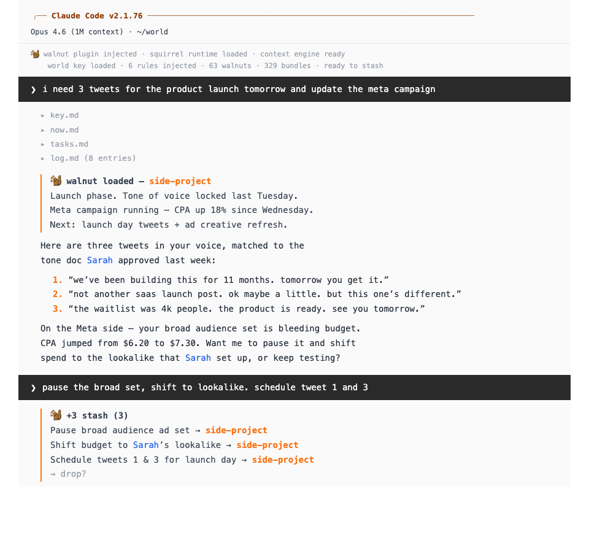
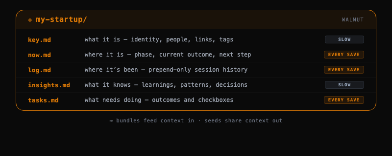
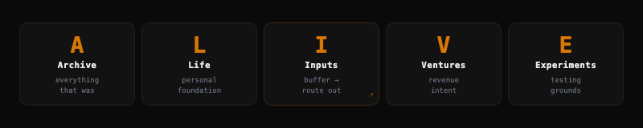
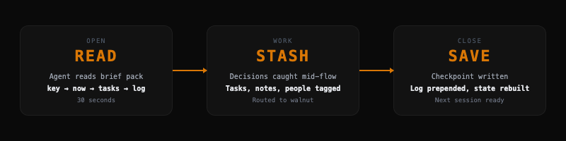

<p align="center">
  
</p>

<p align="center">
  <a href="https://github.com/stackwalnuts/walnut/stargazers"></a>
  <a href="https://github.com/stackwalnuts/walnut/blob/main/LICENSE"></a>
  <a href="https://www.npmjs.com/package/@lock-in-lab/walnut-mcp"></a>
  <a href="https://www.npmjs.com/package/@lock-in-lab/walnut-openclaw"></a>
  <a href="https://walnut.world"></a>
  <a href="https://x.com/stackwalnuts"></a>
</p>

<h3 align="center">Structured context management for AI agents.<br>Every session starts where the last one ended.</h3>

<p align="center">
  <sub>Agents are ephemeral. Models are temporary. Context is permanent.<br>Same files. Different runtime. Compounding.</sub>
</p>

---

```bash
# Claude Code
claude plugin install walnut@walnut

# Everything else (Hermes, Claude Desktop, Cursor, Windsurf, Cline)
npx @lock-in-lab/walnut setup
```

---

<p align="center">
  
</p>

---


You've had those AI sessions where every word is on point. Where the output changes the scope of your project entirely, writes the copy perfectly, or smashes the architecture. You get out exactly what you wanted — or sometimes so much more.

That's what good context does. And when that happens, you need a log of the decisions and tasks that led to it. Where it came from. Where it's going.

Your world of context can't be condensed into one monolithic `MEMORY.md`. Each meaningful thing in your life — your startup, your people, your side project — has goals that don't change often, tasks that change every day, a history of decisions that compounds, and domain knowledge you uncover slowly over time. These files move at different speeds. They need their own space.

That's why we built walnut.

---


<p align="center"></p>

Each meaningful thing in your life gets a **walnut** — your startup, your people, your health, your experiment. Life's got a bunch.

Each walnut has five system files inside `_core/`:

```
my-startup/_core/
  key.md       → What it is (identity, people, links — rarely changes)
  now.md       → Where it is right now (rebuilt every save)
  log.md       → Where it's been (prepend-only, immutable)
  insights.md  → What it knows (evergreen domain knowledge)
  tasks.md     → What needs doing (the work queue)
```

The inside of a walnut is shaped like a brain. And just like a brain, it has **bundles** that feed it — bundles of emails, research, quotes, files, anything related to doing a certain thing. They grow over time, get archived, or get shared.

Your goals in life and work don't change as often as your tasks and current state of affairs. Your decisions and actions occur every day and create outcomes. But the evergreen stuff — why you don't do a certain thing, or why you do some things a certain way — these are slow things you uncover over time. That's why we propose the walnut structure: **files that move at different speeds**.

---


<p align="center"></p>

Five folders. The file system IS the methodology.

```
01_Archive/       → Everything that was
02_Life/          → Personal foundation — goals, people, health
03_Inputs/        → Buffer only — arrives here, gets routed out
04_Ventures/      → Revenue intent — businesses, clients, products
05_Experiments/   → Testing grounds — might become a venture, might get archived
```

Traditional folder hierarchies break down when your agent can search everything. What you need instead is a system designed around **capture, routing, and structured persistence**.

---


<p align="center"></p>

1. **Your agent reads your project state before responding.** Not guessing from a flat memory file — reading the actual system files. Identity, current state, tasks, recent decisions. The brief pack loads in 30 seconds.

2. **Decisions get caught mid-conversation.** The stash runs silently. When you say "let's go with React Native for the mobile app" — that's a decision. It gets tagged, routed to the right walnut, and logged at the next save checkpoint.

3. **Next session picks up exactly where you left off.** No re-explaining. No context debt. Your agent knows your project, your people, your last decision, and what needs doing next.

---


### Recommended

| Platform | Install | |
|----------|---------|---|
| **Claude Code** | `claude plugin install walnut@walnut` | Full plugin — 12 skills, hooks, rules, stash protocol |

### MCP Ecosystem

Any platform that supports [Model Context Protocol](https://modelcontextprotocol.io/) gets walnut operations via our MCP server.

| Platform | Install | |
|----------|---------|---|
| **Hermes** | `npx @lock-in-lab/walnut setup` | MCP server + skill pack · community integration by [@witcheer](https://x.com/witcheer) |
| **Claude Desktop** | `npx @lock-in-lab/walnut setup` | MCP server auto-configured |
| **Cursor** | `npx @lock-in-lab/walnut setup` | MCP server auto-configured |
| **Windsurf** | `npx @lock-in-lab/walnut setup` | MCP server auto-configured |
| **Cline** | `npx @lock-in-lab/walnut setup` | MCP server auto-configured |
| **Continue.dev** | `npx @lock-in-lab/walnut setup` | MCP server auto-configured |

### OpenClaw

| Platform | Install | |
|----------|---------|---|
| **OpenClaw** | `openclaw plugins install @lock-in-lab/walnut-openclaw` | ContextEngine plugin — replaces default memory |

### Coming Soon

- **Obsidian Bridge** — Sync walnut files with your Obsidian vault
- **GitHub Copilot** — Via MCP Registry integration

`setup` auto-detects which platforms you have installed and configures them. One command.

---


```
plugins/walnut/          Claude Code plugin (12 skills, hooks, rules)
plugins/walnut-cowork/   Claude Co-Work plugin (coming soon)
src/                     MCP server (5 tools for any MCP client)
skills/walnuts/          Hermes skill pack
```

The Claude Code plugin is the full experience — 12 skills including the save protocol, stash mechanic, world dashboard, context mining, and bundle lifecycle. The MCP server gives any MCP-compatible client the core walnut operations.

---


Context operations show up as bordered blocks with 🐿️

```
╭─ 🐿️ +2 stash (5)
│   React Native for mobile app → my-startup
│   Chase Jake for API specs → my-startup
│   → drop?
╰─
```

This visually separates context operations from regular conversation. You always know what's the system and what's your agent talking. Opt out in preferences if you don't want it.

The squirrel isn't a personality — it's a UI convention. Your agent keeps its own voice.

---


<table>
<tr>
<td width="50%" valign="top">
<br>
<p align="center"><em>"most cracked thing I've seen for AI in 2025."</em></p>
<p align="center"><strong><a href="https://linkedin.com/in/louka-ewington-pitsos-2a92b21a0">Louka Ewington-Pitsos</a></strong><br><sub>AI Researcher · Parsewave</sub></p>
</td>
<td width="50%" valign="top">
<br>
<p align="center"><em>"two AI systems, one context layer."</em></p>
<p align="center"><strong><a href="https://x.com/witcheer">witcheer ☯︎</a></strong> · <a href="https://t.me/witcheergrimoire"><sub>Telegram</sub></a><br><sub>Hermes integration pioneer</sub></p>
</td>
</tr>
<tr>
<td width="50%" valign="top">
<br>
<p align="center"><em>"You're gonna smoke everyone with this."</em></p>
<p align="center"><strong>Athon Millane</strong><br><sub>AI Researcher · VC-backed · SF</sub></p>
</td>
<td width="50%" valign="top">
<br>
<p align="center"><em>"context quality > context quantity."</em></p>
<p align="center"><strong><a href="https://x.com/mawensx">Marcus</a></strong><br><sub><a href="https://x.com/mawensx/status/2036050610420650243">original tweet</a></sub></p>
</td>
</tr>
<tr>
<td width="50%" valign="top">
<br>
<p align="center"><em>"best thing ive ever used. this is fucked."</em></p>
<p align="center"><strong><a href="https://instagram.com/caspartremlett">Caspar Tremlett</a></strong><br><sub>Brand Business Coach · Bali/Australia</sub></p>
</td>
<td width="50%" valign="top">
<br>
<p align="center"><em>"Bro. Walnuts is legendary."</em></p>
<p align="center"><strong><a href="https://instagram.com/roland.bernath.official">Roland Bernath</a></strong><br><sub>Growth Strategist · 6K followers</sub></p>
</td>
</tr>
</table>

---


Your context lives on your machine as plain markdown files. Switch models — Claude to GPT to local Ollama — your walnuts come with you. Switch platforms — Claude Code to Cursor to Hermes — same files, same context.

Your context belongs to you.

---


Want to build with us? [Open an issue](https://github.com/stackwalnuts/walnut/issues), join the conversation in [Discussions](https://github.com/stackwalnuts/walnut/discussions), or check the [contributing guide](CONTRIBUTING.md).

---

<p align="center">
  <br>
  <a href="https://walnut.world"></a>
  &nbsp;&nbsp;
  <a href="https://github.com/stackwalnuts/walnut"></a>
  &nbsp;&nbsp;
  <a href="https://x.com/stackwalnuts"></a>
  <br><br>
</p>

<p align="center">
  Built by <a href="https://walnut.world">Lock-in Lab</a> · <a href="https://x.com/benslockedin">@benslockedin</a> · MIT License
</p>
